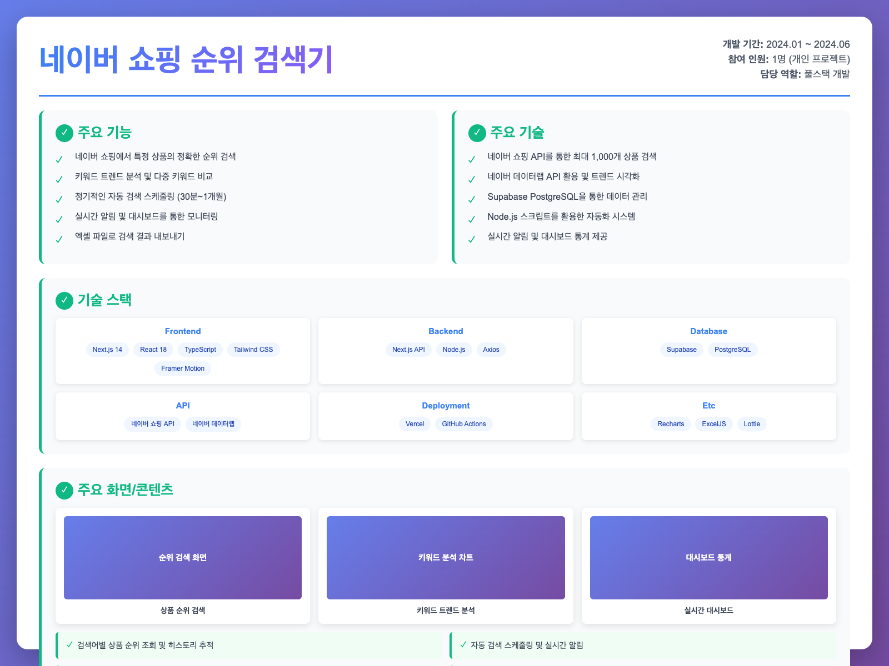
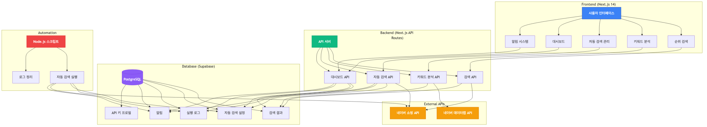
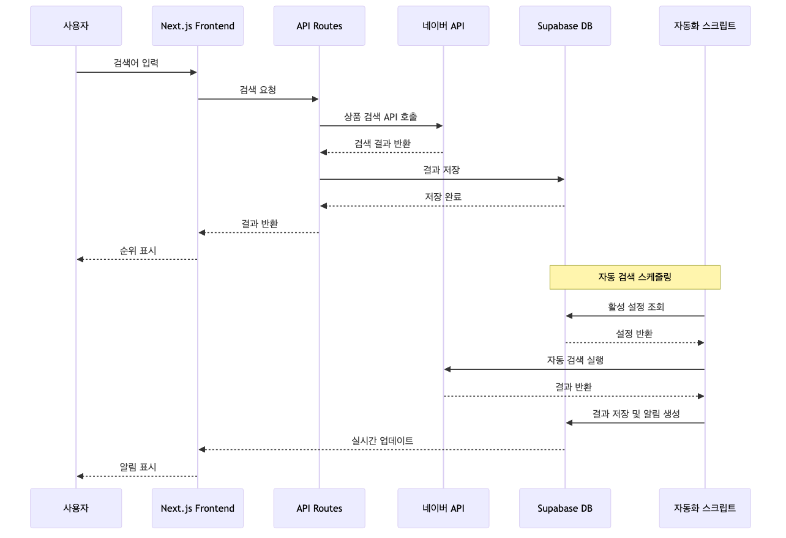

# 네이버 쇼핑 순위 검색 및 키워드 분석 시스템

## 프로젝트 개요

네이버 쇼핑 API와 데이터랩 API를 활용하여 상품 순위 검색, 키워드 트렌드 분석, 자동화된 스케줄링을 제공하는 종합적인 마케팅 분석 도구입니다.

### 대표 그림 (Project Overview)



### 시스템 아키텍처 (System Architecture)



### 주요 기능 흐름도



## 프로젝트 정보

### 설명 (Description)
네이버 쇼핑 API를 활용하여 특정 상품의 검색 순위를 실시간으로 조회하고, 네이버 데이터랩 API를 통해 키워드 트렌드 데이터를 분석하는 웹 애플리케이션입니다. 정기적인 자동 검색 스케줄링과 실시간 알림 시스템을 통해 상품 순위 변화를 지속적으로 모니터링할 수 있습니다.

### Date
2024년 1월 ~ 2024년 6월 (6개월)

### 참여자 (Participants)
1명 (개인 프로젝트)

### 담당역할 (Roles)
- **프론트엔드 개발**: Next.js 14 App Router 기반 UI/UX 개발
- **백엔드 개발**: Next.js API Routes를 활용한 서버리스 API 개발
- **데이터베이스 설계**: Supabase PostgreSQL 스키마 설계 및 최적화
- **자동화 시스템**: 자동 검색 스케줄링 및 실행 로직 구현
- **API 통합**: 네이버 쇼핑 API 및 데이터랩 API 연동
- **배포 및 인프라**: Vercel 서버리스 배포 및 CI/CD 구축

### 라이브러리 (Libraries)
- **언어**: TypeScript, JavaScript
- **프레임워크**: Next.js 14, React 18
- **스타일링**: Tailwind CSS
- **애니메이션**: Framer Motion
- **데이터 시각화**: Recharts
- **데이터베이스**: Supabase (PostgreSQL), @supabase/supabase-js
- **HTTP 클라이언트**: Axios
- **엑셀 처리**: ExcelJS, xlsx
- **아이콘**: Lucide React
- **애니메이션**: Lottie React
- **유틸리티**: Lodash

### 목표 (Goal)
1. 네이버 쇼핑 API를 활용하여 특정 상품의 검색 순위를 정확하게 조회하는 시스템 구축
2. 네이버 데이터랩 API를 통한 키워드 트렌드 분석 기능 구현
3. 정기적인 자동 검색을 통해 상품 순위 변화를 지속적으로 모니터링하는 자동화 시스템 개발
4. 실시간 알림 및 대시보드를 통한 직관적인 데이터 시각화 제공
5. 다중 API 키 관리 및 사용량 추적 시스템 구축

### 담당 (Responsibilities)
1. **프론트엔드 개발**
   - Next.js 14 App Router 기반 반응형 웹 애플리케이션 개발
   - Tailwind CSS를 활용한 현대적인 UI/UX 구현
   - Framer Motion을 통한 부드러운 애니메이션 효과 적용
   - Recharts를 활용한 데이터 시각화 (순위 추이, 키워드 트렌드)
   - 다크 모드 지원 및 반응형 디자인 구현

2. **백엔드 API 개발**
   - Next.js API Routes를 활용한 RESTful API 엔드포인트 개발
   - 네이버 쇼핑 API 연동 및 상품 순위 검색 로직 구현
   - 네이버 데이터랩 API 연동 및 키워드 트렌드 분석 기능 구현
   - API 호출 제한 관리 및 재시도 로직 구현
   - 엑셀 파일 생성 및 내보내기 기능 구현

3. **데이터베이스 설계 및 관리**
   - Supabase PostgreSQL 데이터베이스 스키마 설계
   - 검색 결과, 자동 검색 설정, 실행 로그, 알림 등 테이블 설계
   - 데이터베이스 인덱싱 및 성능 최적화
   - Row Level Security (RLS)를 통한 데이터 보안 구현

4. **자동 검색 시스템**
   - 정기적인 자동 검색 스케줄링 시스템 구현
   - Node.js 스크립트를 통한 자동 검색 실행 로직 개발
   - 검색 결과 히스토리 관리 및 추적 기능 구현
   - 실행 로그 및 오류 추적 시스템 구축

5. **실시간 알림 시스템**
   - 자동 검색 실행 결과에 따른 실시간 알림 생성
   - 알림 읽음/미읽음 상태 관리
   - 우선순위별 알림 분류 및 표시

6. **API 키 관리 시스템**
   - 다중 네이버 API 키 프로필 관리 기능 구현
   - API 키별 사용량 추적 및 마지막 사용 시간 기록
   - 기본 프로필 설정 및 자동 로테이션 기능

### 성과 (Achievements)
1. **정확한 순위 검색 시스템 구축**
   - 네이버 쇼핑 API를 활용하여 최대 1,000개 상품까지 검색 가능
   - 상품명, 쇼핑몰명, 브랜드명을 통한 정밀 필터링 기능 구현
   - 실제 네이버 쇼핑 웹페이지 기준으로 정확한 페이지 및 순위 계산

2. **키워드 트렌드 분석 기능 구현**
   - 네이버 데이터랩 API를 통한 검색어 트렌드 데이터 수집
   - 최대 5개 키워드 동시 비교 분석 기능
   - 시간, 연령, 성별, 디바이스별 다차원 분석 지원
   - Recharts를 활용한 인터랙티브 차트 시각화

3. **자동 검색 스케줄링 시스템 개발**
   - 30분~1개월 간격으로 유연한 스케줄링 설정 가능
   - 여러 검색어를 동시에 모니터링하는 다중 설정 관리
   - 자동 검색 실행 로그 및 히스토리 추적 기능
   - 실행 성공률, 오류율 등 통계 대시보드 제공

4. **실시간 알림 및 모니터링 시스템**
   - 자동 검색 실행 결과에 따른 실시간 알림 생성
   - 30초마다 자동 새로고침되는 실시간 대시보드
   - 성공/오류/경고/정보 등 다양한 알림 타입 지원
   - 우선순위별 알림 분류 및 읽음 관리 기능

5. **데이터 시각화 및 분석**
   - 시간별 순위 변화 추이 차트 제공
   - 다중 키워드 비교 라인 차트
   - 실행 성공률, 오류율 등 KPI 대시보드
   - 엑셀 파일로 분석 결과 내보내기 기능

6. **성능 최적화 및 안정성 향상**
   - API 호출 제한 준수 및 재시도 로직 구현
   - 데이터베이스 인덱싱을 통한 쿼리 성능 최적화
   - 스켈레톤 로딩 및 로딩 상태 관리로 UX 개선
   - 오류 처리 및 예외 상황 대응 로직 구현

7. **배포 및 인프라 구축**
   - Vercel 서버리스 플랫폼에 배포
   - Supabase와의 자동 연동 설정
   - 환경변수를 통한 안전한 API 키 관리
   - GitHub Actions를 통한 CI/CD 파이프라인 구축

### Link
- **GitHub 저장소**: https://github.com/cscs0829/naver-ranking
- **라이브 데모**: (Vercel 배포 URL)

---

## 프로젝트 중 맡은 부분

### 1. Next.js 기반 프론트엔드 개발

**설명**: Next.js 14 App Router를 활용한 현대적인 웹 애플리케이션 UI/UX 개발

**주요 구현 내용**:
- **탭 기반 네비게이션 시스템**: 순위 검색, 순위 결과, 자동 검색, 키워드 분석 등 8개 주요 기능 탭 구현
- **반응형 디자인**: 모바일과 데스크톱에서 최적화된 경험 제공
- **다크 모드 지원**: 시스템 설정에 따른 자동 다크 모드 전환
- **Framer Motion 애니메이션**: 페이지 전환, 모달, 카드 등에 부드러운 애니메이션 효과 적용
- **실시간 데이터 업데이트**: 30초마다 자동 새로고침되는 대시보드 및 알림 시스템

**기술 스택**: Next.js 14, React 18, TypeScript, Tailwind CSS, Framer Motion

### 2. 네이버 API 연동 및 검색 로직 구현

**설명**: 네이버 쇼핑 API를 활용한 상품 순위 검색 및 키워드 트렌드 분석 기능 구현

**주요 구현 내용**:
- **상품 순위 검색 시스템**: 
  ```typescript
  // 네이버 쇼핑 API를 통한 상품 검색 및 순위 계산
  async findAllMatches(
    searchQuery: string,
    targetProductName?: string,
    targetMallName?: string,
    targetBrand?: string,
    maxPages: number = 10
  ): Promise<{ items: SearchResult[]; totalSearched: number }>
  ```
  - 최대 1,000개 상품까지 검색 가능
  - 실제 네이버 쇼핑 웹페이지 기준으로 정확한 페이지 및 순위 계산
  - 상품명, 쇼핑몰명, 브랜드명을 통한 정밀 필터링

- **키워드 트렌드 분석**:
  - 네이버 데이터랩 API를 통한 검색어 트렌드 데이터 수집
  - 최대 5개 키워드 동시 비교 분석
  - 시간, 연령, 성별, 디바이스별 다차원 분석 지원

- **API 호출 제한 관리**:
  - 네이버 API 초당 1회 호출 제한 준수
  - 재시도 로직 및 오류 처리 구현
  - 타임아웃 설정 (30초)

**기술 스택**: TypeScript, Axios, 네이버 쇼핑 API, 네이버 데이터랩 API

### 3. 자동 검색 스케줄링 시스템

**설명**: 정기적인 자동 검색을 통해 상품 순위 변화를 지속적으로 모니터링하는 시스템

**주요 구현 내용**:
- **스케줄 설정 관리**:
  ```typescript
  // 자동 검색 설정 생성 및 관리
  interface AutoSearchConfig {
    name: string;
    search_query: string;
    target_product_name?: string;
    target_mall_name?: string;
    target_brand?: string;
    max_pages: number;
    interval_hours: number; // 30분~1개월 간격 설정 가능
    is_active: boolean;
  }
  ```
  - 30분~1개월 간격으로 유연한 스케줄링 설정
  - 여러 검색어를 동시에 모니터링하는 다중 설정 관리
  - 설정 활성화/비활성화 기능

- **자동 검색 실행 로직**:
  ```javascript
  // Node.js 스크립트를 통한 자동 검색 실행
  // scripts/auto-search.js
  async function runAutoSearch(configId) {
    // 활성화된 설정 조회
    // 네이버 API를 통한 상품 검색
    // 검색 결과 데이터베이스 저장
    // 실행 로그 및 알림 생성
  }
  ```
  - Node.js 스크립트를 통한 자동 검색 실행
  - 검색 결과 히스토리 관리 및 추적
  - 실행 로그 및 오류 추적 시스템

- **실행 결과 관리**:
  - 검색 결과를 `auto_search_results` 테이블에 누적 저장
  - 날짜별, 시간별 히스토리 조회 기능
  - 엑셀 파일로 히스토리 내보내기

**기술 스택**: Node.js, TypeScript, Supabase, 네이버 쇼핑 API

### 4. 실시간 알림 및 대시보드 시스템

**설명**: 자동 검색 실행 결과에 따른 실시간 알림 생성 및 통계 대시보드 제공

**주요 구현 내용**:
- **실시간 알림 시스템**:
  ```typescript
  // 자동 검색 실행 결과에 따른 알림 생성
  await supabase.from('auto_search_notifications').insert({
    type: 'success' | 'error' | 'warning' | 'info',
    title: string,
    message: string,
    config_id: number,
    priority: 'low' | 'normal' | 'high' | 'urgent'
  });
  ```
  - 자동 검색 실행 결과에 따른 실시간 알림 생성
  - 성공/오류/경고/정보 등 다양한 알림 타입 지원
  - 우선순위별 알림 분류 및 읽음 관리 기능
  - 30초마다 자동 새로고침

- **통계 대시보드**:
  ```typescript
  // 대시보드 통계 데이터 조회
  interface DashboardStats {
    totalConfigs: number;        // 총 설정 수
    activeConfigs: number;       // 활성 설정 수
    totalRuns: number;           // 총 실행 횟수
    successRuns: number;         // 성공 실행 횟수
    errorRuns: number;           // 실패 실행 횟수
    totalResults: number;        // 총 검색 결과 수
    recentActivity: Activity[];  // 최근 활동
    scheduleRankings: Schedule[]; // 스케줄별 순위 결과
  }
  ```
  - 실행 성공률, 오류율 등 KPI 표시
  - 스케줄별 최신 순위 결과 표시
  - 최근 활동 로그 및 실행 히스토리 조회
  - 필터링 기능 (검색어, 상품명, 쇼핑몰명, 브랜드명)

**기술 스택**: React, TypeScript, Supabase, Recharts

### 5. 데이터베이스 설계 및 최적화

**설명**: Supabase PostgreSQL 데이터베이스 스키마 설계 및 성능 최적화

**주요 구현 내용**:
- **데이터베이스 스키마 설계**:
  ```sql
  -- 주요 테이블 구조
  CREATE TABLE search_results (
    id SERIAL PRIMARY KEY,
    search_query VARCHAR(255) NOT NULL,
    target_product_name VARCHAR(255),
    page INTEGER NOT NULL,
    rank_in_page INTEGER NOT NULL,
    total_rank INTEGER NOT NULL,
    product_title TEXT NOT NULL,
    -- ...
  );
  
  CREATE TABLE auto_search_configs (
    id SERIAL PRIMARY KEY,
    name VARCHAR(255) NOT NULL,
    search_query VARCHAR(255) NOT NULL,
    interval_hours DECIMAL(5,2) DEFAULT 1,
    is_active BOOLEAN DEFAULT true,
    -- ...
  );
  
  CREATE TABLE auto_search_results (
    id SERIAL PRIMARY KEY,
    config_id INTEGER REFERENCES auto_search_configs(id),
    -- 검색 결과 데이터
  );
  
  CREATE TABLE auto_search_logs (
    id SERIAL PRIMARY KEY,
    config_id INTEGER REFERENCES auto_search_configs(id),
    status VARCHAR(50) NOT NULL,
    duration_ms INTEGER,
    results_count INTEGER,
    -- ...
  );
  
  CREATE TABLE auto_search_notifications (
    id SERIAL PRIMARY KEY,
    type VARCHAR(20) NOT NULL,
    title VARCHAR(255) NOT NULL,
    message TEXT NOT NULL,
    config_id INTEGER REFERENCES auto_search_configs(id),
    priority VARCHAR(20) DEFAULT 'normal',
    read BOOLEAN DEFAULT false,
    -- ...
  );
  
  CREATE TABLE api_key_profiles (
    id SERIAL PRIMARY KEY,
    name VARCHAR(255) UNIQUE NOT NULL,
    client_id TEXT NOT NULL,
    client_secret TEXT NOT NULL,
    api_type VARCHAR(20) DEFAULT 'shopping',
    is_default BOOLEAN DEFAULT false,
    usage_count INTEGER DEFAULT 0,
    -- ...
  );
  ```

- **성능 최적화**:
  - 적절한 인덱스 설정 (검색어, 생성일시, 설정 ID 등)
  - 정규화된 스키마 설계
  - Row Level Security (RLS)를 통한 데이터 보안 구현
  - 연결 풀링 및 쿼리 최적화

**기술 스택**: PostgreSQL, Supabase, SQL

### 6. API 키 관리 시스템

**설명**: 다중 네이버 API 키 프로필 관리 및 사용량 추적 시스템

**주요 구현 내용**:
- **API 키 프로필 관리**:
  ```typescript
  // API 키 프로필 생성 및 관리
  interface ApiKeyProfile {
    name: string;
    client_id: string;
    client_secret: string;
    api_type: 'shopping' | 'insights';
    is_default: boolean;
    is_active: boolean;
    usage_count: number;
    last_used_at: Date;
  }
  ```
  - 여러 네이버 API 키를 안전하게 관리
  - 쇼핑 API와 데이터랩 API별로 별도 프로필 관리
  - 기본 프로필 설정 및 자동 로테이션 기능
  - 클라이언트 시크릿 마스킹 표시

- **사용량 추적**:
  - API 키별 사용량 및 마지막 사용 시간 기록
  - 프로필별 활성화/비활성화 관리
  - 사용량 통계 및 모니터링

**기술 스택**: TypeScript, Supabase, React

### 7. 데이터 시각화 및 엑셀 내보내기

**설명**: Recharts를 활용한 데이터 시각화 및 ExcelJS를 통한 엑셀 파일 생성

**주요 구현 내용**:
- **데이터 시각화**:
  ```typescript
  // Recharts를 활용한 차트 구현
  <LineChart data={trendData}>
    <Line dataKey="value" stroke="#8884d8" />
    <XAxis dataKey="date" />
    <YAxis />
    <Tooltip />
    <Legend />
  </LineChart>
  ```
  - 시간별 순위 변화 추이 차트
  - 다중 키워드 비교 라인 차트
  - 실행 성공률, 오류율 등 KPI 대시보드

- **엑셀 내보내기**:
  ```typescript
  // ExcelJS를 활용한 엑셀 파일 생성
  const workbook = new ExcelJS.Workbook();
  const worksheet = workbook.addWorksheet('검색 결과');
  // 데이터 추가 및 스타일링
  const buffer = await workbook.xlsx.writeBuffer();
  // Blob 생성 및 다운로드
  ```
  - 검색 결과를 엑셀 파일로 내보내기
  - 키워드 분석 결과를 엑셀 파일로 내보내기
  - 자동 검색 히스토리를 엑셀 파일로 내보내기
  - 필터 조건에 맞는 데이터만 선택적으로 내보내기

**기술 스택**: Recharts, ExcelJS, React, TypeScript

---

## 주요 기술적 성과

1. **정확한 순위 계산 알고리즘**: 네이버 쇼핑 API의 100개 단위 검색과 실제 웹페이지의 40개 단위 표시 간 차이를 고려한 정확한 페이지 및 순위 계산 로직 구현

2. **엄격한 상품 매칭 시스템**: 자동 검색을 위한 정확한 상품 매칭 알고리즘 구현 (HTML 태그 제거, 공백 정규화, 키워드 기반 매칭 등)

3. **효율적인 API 호출 관리**: 네이버 API 호출 제한을 준수하면서도 빠른 검색을 위한 최적화된 호출 전략 구현

4. **실시간 데이터 동기화**: Supabase를 활용한 실시간 데이터베이스 업데이트 및 프론트엔드 자동 새로고침 시스템

5. **확장 가능한 아키텍처**: 모듈화된 컴포넌트 구조와 재사용 가능한 유틸리티 함수를 통한 유지보수성 향상

